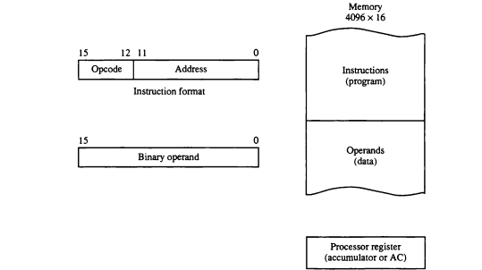

## Morris Mano's Basic Computer
The aim of this repository is to develope the basic computer taught in Morris Mano's computer system architecture book with Verilog HDL (I will try to make another repository about Verilog and Digital System Design).

### How to work with Modelsim?
First, try to install the free version of Modelsim (assumption is that you are a student). Then, easily make a new project, then make new files (verilog) or add them (if you like to use another editor like VS-code that has extensions for verilog HDL). After compiling all of your files (and if you don't have any errors), start simulations. Then, add the signals that you want to see them on your waveform. Additioinally, always try to write test benches (I say it because I guess if you have worked with Alter's Quartus you tend to change the signals manually). See the written test benches in this repository to get an idea how to do it easily. Finally, if you need to know and see more [this - Modelsim starters](https://www.nandland.com/vhdl/tutorials/tutorial-modelsim-simulation-walkthrough.html) and [this - Test Bench Writing](https://verilogguide.readthedocs.io/en/latest/verilog/testbench.html) can be useful.

### Morris Mano Basic Computer
This computer is a one-addressed computer (or a accumulator-based computer) because in all of the operations (instructions) always one operand is AC (Accumulator Register) and the other one can be a register or memory word or immediate value [Read More](https://www.geeksforgeeks.org/computer-organization-instruction-formats-zero-one-two-three-address-instruction/).

In this computer, It is assumed that we have 4096 16-bit wide words in our memory, so because of this our AR is a 12-bit register.

This is the version 1.1 of this basic computer. This version just can execute instructions from its memory. It does not support any peripherals or interrupt cycle. The next steps include adding INPR and OUTR registers then trying to add interrupt cycle to this computer.

**Note on Hardwired vs. Micro-programmed control units**: a control unit is called harwired when its datapath controlling signals are produced with a logical circuit. On the other hand, micro-programmed control unit is the one that its signals are stored in a memory inaccessible by the programmer. In this basic computer, our control unit is hardwired if you look into the control unit module. In the near future, I will try to develop another simple computer which its control unit is a micro-programmed one.

### Very short and easy Tutorial on Morris Mano's basic computer
The following image shows a very basic vision on how a computer runs a program by fetching a instruction, decoding, fetching more data from memory, executing, and finally writing back the processed data.

